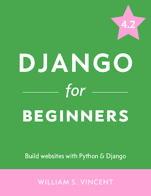

# Django for Beginners

This is the code repository for [Django for Beginners](https://djangoforbeginners.com/), written by [William Vincent](https://wsvincent.com). It contains all the supporting project files necessary to work through the book from start to finish.

## Source Code for Previous Editions
- [4.0 version repo](https://github.com/wsvincent/djangoforbeginners_40)
- [3.2 version repo](https://github.com/wsvincent/djangoforbeginners_32)
- [3.1 version repo](https://github.com/wsvincent/djangoforbeginners_31)
- [3.0 version repo](https://github.com/wsvincent/djangoforbeginners_30)